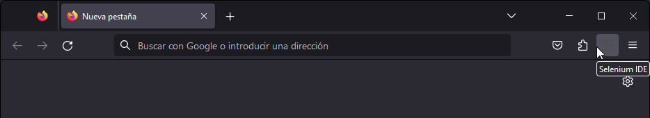
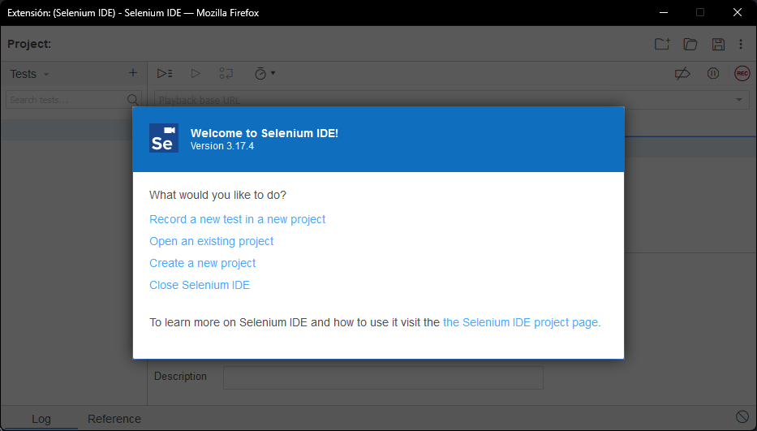
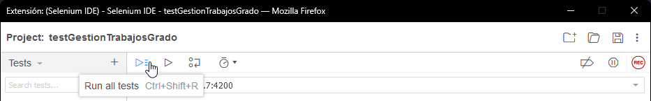

# Reporte de pruebas del frontend para el Sistema de Gestión de Trabajos de Grado de la Universidad del Cauca
Este informe detalla las pruebas de integración realizadas en el Frontend
del Sistema de Gestión de Trabajos de Grado de la Universidad del Cauca,
construido con Angular.
Utilizando la potente herramienta Selenium,
hemos registrado y evaluado el funcionamiento del sistema,
realizando pruebas de integracion para garantizar su estabilidad y eficiencia.
A través de este informe,
exploraremos las pruebas,
procedimientos y resultados que aseguran un Frontend confiable y acorde a las necesidades de la comunidad universitaria,
junto con unas pruebas de regresion que nos permite verificar que el trabajo se hace de manera incremental y asertiva.

A continuacion se presenta la configuracion para ejecutar las pruebas y sus resultados:

## Ejecucion de las pruebas
Se asume que la base de datos y el backend ya estan funcionando y corriendo.

### 1. Instalar la extension de Selenium IDE
[Selenium IDE (Extension)](https://www.selenium.dev/selenium-ide/)

### 2. Ejecutar la extension
Click en la extension instalada en el navegador

### 3. Abrir el archivo de test de Selenium IDE
Cargar el archivo `testGestionTrabajosGrado.side` en la extension Selenium IDE
con la opcion "Open an existing project" archivo ubicado en Test/

)

### 4. Ejecutar las pruebas
Ejecutar las pruebas con el boton `Run all tests`

Advertencia: Tener en cuenta que es muy posible que las pruebas no vayan a funcionar
debido a que estan configuradas con la ip de un equipo local,
por lo tanto para correr las pruebas adecuadamente,
se necesita ajustar las pruebas para que apunten a la direccion ip adecuada.

## Resultados
Los resultados seran plasmados a detalle en un documento de excel llamado
`Bateria_de_pruebas_Gestion_Trabajos_grados` ubicado en Test/

A continuacion se muestra un gif que muestra el proceso de ejecucion junto con una serie de tablas que resumen las pruebas realizadas, esta ejecucion tambien se encuentra como video presente en el repositorio en la ubicacion `Test/img/vid_test_run_1.mp4` o tambien en Youtube (Click en la imagen GIF).

### **Tests suit Users**
| # Test | Descripcion | Resultado |
|--------|-------------|-----------|
| 1 | Buscar userTest (id = 0) | Exito |
| 2 | Crear el usuario (ID = 1060) | Exito |
| 3 | Crear el usuario (ID = 1061) | Exito |
| 4 | Buscar el usuario (ID = 1060) | Exito |
| 5 | Buscar el usuario (ID = 1061) | Exito |
| 6 | Eliminar el usuario (ID = 1060) | Exito |
| 7 | Eliminar el usuario (ID = 1061) | Exito |
||TO DO: Others||

### **Tests suit Formatos**
| # Test | Descripcion | Resultado |
|--------|-------------|-----------|
| 1 | Subir formato  |  |